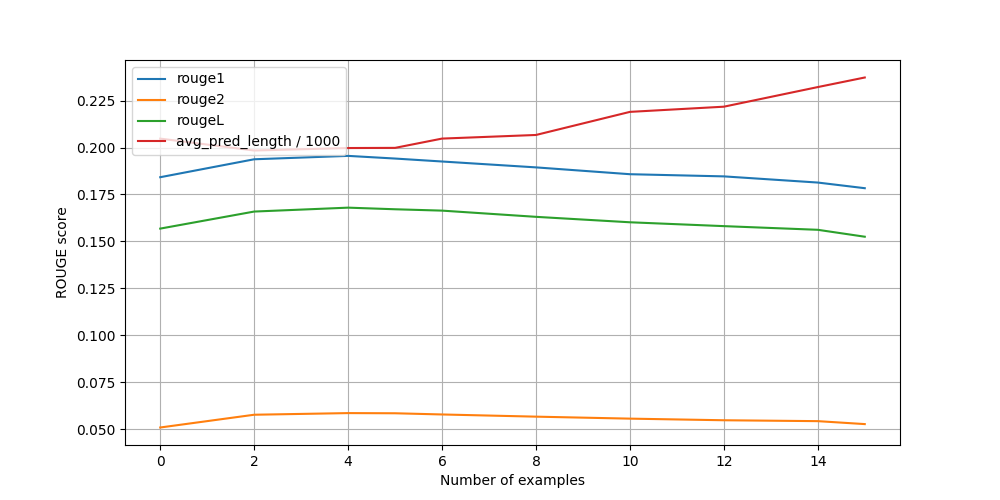

# LLM in context bias
Evaluating LLM performance for mis-matched prompts

# Tasks
- [ ] Verify that model performance noticeably improves as the number of in-context examples increase
- [ ] Verify that the model performance is degraded by the number of out-of-context examples


---
## Code Setup

The entry point for the code is in [`main.py`](main.py). 
- The args that can be specified can be found in [src/tools/args.py](src/tools/args.py)
- Models can be found in [src/inference/models.py](src/inference/models.py)
- Datasets can be found in [src/data/dataloader.py](src/data/dataloader.py)

To run GPT3.5, an openAI API key is required. Specify this in the `.env` file such as:

```.env
# llm-in-context/.env
OPENAI_API_KEY=mykey
```


---
## Results

### Mistral-7b

Switching to Mistral-7b because it is cheaper.

1. Evaluation set: Gigaword



_Performance of Mistral-7b on Gigaword with in-context prompts from Gigaword._

- For < 5 examples, the trend is as expected
- For > 10 examples, the model performs suprisingly worse
  - This may be because the generation length increased - we're not sure why though


> Performance with 5 in-context examples (BUT with the eval and in-context examples prompts swapped in order(!))

```json
{'rouge1': 0.0566397674739907, 'rouge2': 0.013867040607940579, 'rougeL': 0.047584838289689686, 'rougeLsum': 0.04845559344467277}
```

### Results for incontext examples

1. Evaluation set: Rotten tomatoes
- gpt3.5 sentiment classification on Rotten Tomatoes doesn't suffer when using gigaword in context examples. Perhaps this is because the dataset is too easy.

| Ex  | rt    | gigaword |
| --- | ----- | -------- |
| 0   |       | 91.28    |
| 2   |       | 91.74    |
| 4   |       | 92.12    |
| 6   |       | 91.93    |
| 8   |       | 92.21    |
| 10  | 91.84 | 92.31    |

2. Evaluation set Gigaword

- incontext examples rotten tomatoes

| Ex  | Rouge Metic | rt    | gigaword |
| --- | ----------- | ----- | -------- |
| 0   | 1           | 0.193 | 0.193    |
|     | 2           | 0.054 | 0.055    |
|     | L           | 0.166 | 0.166    |
|     | Lsum        | 0.166 | 0.166    |
| 10  | 1           | 0.190 | 0.253    |
|     | 2           | 0.054 | 0.088    |
|     | L           | 0.163 | 0.224    |
|     | Lsum        | 0.163 | 0.231    |
| 20  | 1           | 0.190 | 0.250    |
|     | 2           | 0.053 | 0.086    |
|     | L           | 0.162 | 0.220    |
|     | Lsum        | 0.162 | 0.220    | kl |

### Attempted Research

1. Test with and without shuffling incontext examples.

- Context: When running model predictions for each test set prediction, we give incontext examples
- We believe that it is more robust to provide different in context examples for each test set example. (This is instead of using the same in context example for each run)
- The results are below:

Results for incontext examples that are *not* shuffles

| Ex  | rt    | gigaword |
| --- | ----- | -------- |
| 0   | 92.11 |
| 1   | 91.65 |
| 2   | 92.03 |


Results for in context examples that *are* shuffled each iteration

| Ex  | rt    | gigaword |
| --- | ----- | -------- |
| 0   | 91.81 | 91.92    |
| 1   | 91.77 | 92.48    |
| 2   |       |

2. Prompting for sentiment classification using tags

- This required the output text to be in the format `<sentiment>{positive/negative}</sentiment>`
- The outputs for `gpt3.5` are in `.archive/sentiment-tag-prompts`
- So, we switched to prompting gpt3.5 to ouptut the sentiment as a single word. This worked everytime we tested it.


---
## Datasets

[Gigaword](https://huggingface.co/datasets/gigaword)
- ROUGE metric (see the huggingface website for the metric)